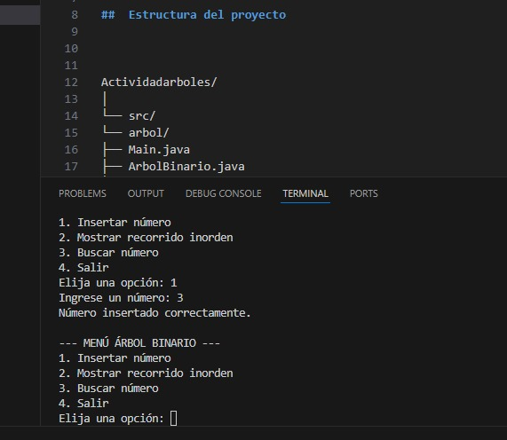

 Árbol Binario de Búsqueda en Java

4  
Permite **insertar**, **buscar** y **mostrar** valores en orden, utilizando una estructura de clases modular en Java.

---

##  Estructura del proyecto

Actividadarboles/
│
└── src/
└── arbol/
├── Main.java
├── ArbolBinario.java
└── Nodo.java

`

- **Nodo.java:** representa un nodo del árbol binario.  
- **ArbolBinario.java:** contiene la lógica para insertar, buscar y recorrer el árbol.  
- **Main.java:** contiene el menú principal para interactuar con el usuario.

---

##  Requisitos

- [Java JDK 17 o superior](https://www.oracle.com/java/technologies/downloads/)
- Visual Studio Code (con extensión **Java Extension Pack**)
- Sistema operativo Windows, macOS o Linux

---

##  Ejecución

1. Abre el proyecto en **VS Code**.
2. Abre una terminal y navega a la carpeta `src`:
   bash
   cd src
`

3. Compila el proyecto:

   bash
   javac arbol/*.java
   
4. Ejecuta el programa:

   bash
   java arbol.Main
   

---

##  Ejemplo de uso

--- MENÚ ÁRBOL BINARIO ---
1. Insertar número
2. Mostrar recorrido inorden
3. Buscar número
4. Salir
Elija una opción: 1
Ingrese un número: 10
Número insertado correctamente.

---

##  Funcionalidades

✅ Insertar valores enteros en el árbol
✅ Mostrar recorrido **inorden** (izquierda → raíz → derecha)
✅ Buscar si un número existe en el árbol
✅ Menú interactivo con opciones para el usuario

---

##  Conceptos clave

* **Árbol Binario de Búsqueda (ABB):** estructura jerárquica donde cada nodo tiene un valor mayor que los de su subárbol izquierdo y menor que los de su subárbol derecho.
* **Recorrido inorden:** muestra los valores del árbol en orden ascendente.

---

##  Autor

**Valentina Gaviria Bedoya**
Proyecto académico para la práctica de estructuras de datos en Java.

